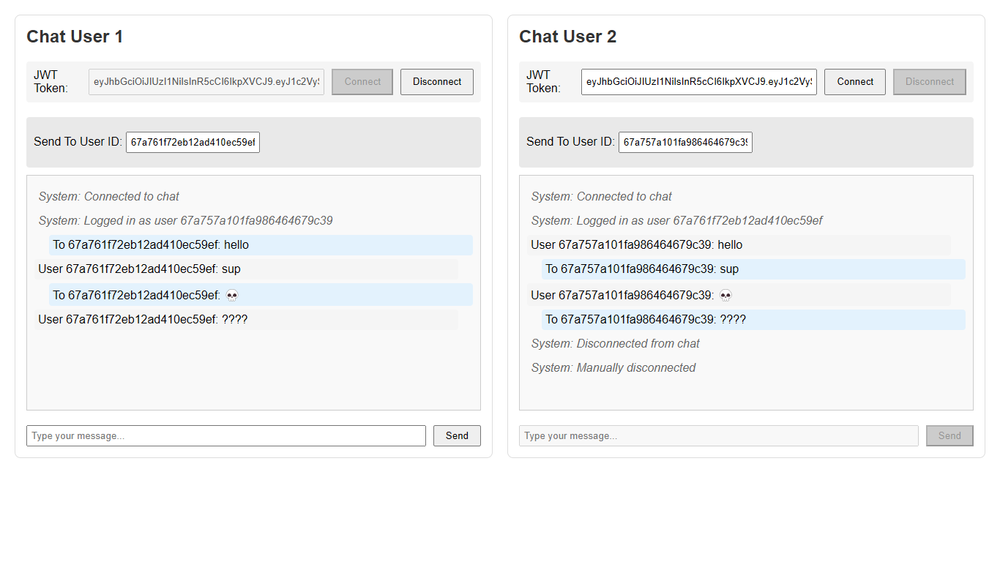

# NestJS Simple Chat Application

This is a real-time chat application built using NestJS, WebSockets, and MongoDB. It supports user registration, login, and the ability to send messages to specific users in a chat system.

## Features

- User registration and login
- WebSocket real-time messaging
- User authentication with JWT
- Message sending to specific users

## Installation

1. Clone the repository:
   ```bash
   git clone https://github.com/Zurihaqi/nestjs-ws-mongodb.git
   cd nestjs-ws-mongodb
   ```
2. Install depedencies
   ```bash
   npm install
   ```
3. Set up the environment variables in a .env file:
   ```bash
   PORT="api_port"
   JWT_SECRET="your_jwt_secret"
   MONGO_URI="your_mongodb_connection_string"
   ```
4. Start the server
   ```bash
   npm run start
   ```

## API Endpoints

- POST /auth/register: Register a new user
- POST /auth/login: Login and get a JWT token
- WebSocket (sendMessage): Send messages to specific users

Full docs in http://localhost:3000/api

Test out the sample chat client in http://localhost:3000/

## Technologies Used

- NestJS
- WebSocket with Socket.io
- MongoDB
- JWT Authentication

## Screenshots


